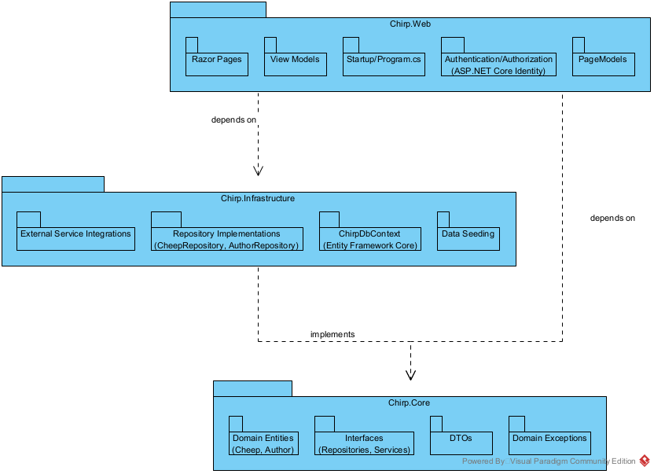
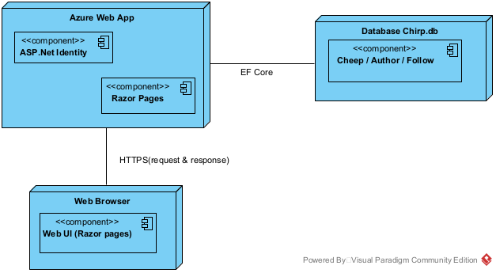
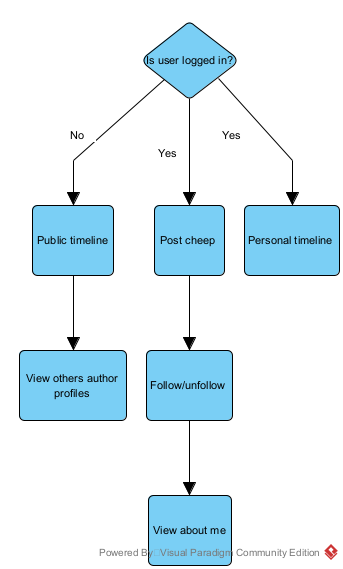

# _Design and Architecture of Chirp!_

## Domain model

The Domain model illustrastes our Models. We chose to illustrate the ASP.Net Identity in an abstract relation to the Author. It represents the authenticated user, while Author represents the user domain.

## Architecture - In the small

Make illustration of the Onion and what resides inside it.

For the Chirp! program we have implemented the Onion-Architecture structure. The structure is built up in layers: Core, Infrastructure and Web.

The Core layer forms the center of the Onion and is independent of all other layers. it contains the service interfaces that define the behavior of the application. This layer does not depend on any of the other layers.

The Infrastructure layer surrounds the Core and provides implementations of the behavior defined in the Core layer. This includes repository implementations, database and external services, such as CheepService.cs. The Infrastructure layer depends on the Core layer, but does not depend on the Web layer.

The Web layer is the outer layer of our Onion. it is resposible for handling HTTP requests and returning responses to the client. All the request/response logic can be found here. It depends on the Core layer and uses the Infrastructure layer through dependency injection.

The layers use Data Transfer Objects (DTO's) to communicate and transfer data from the center of the onion and outwards. Ensuring that entities are not exposed outside the Core layer.

## Achitecture of the deployed application

Chirp! is a client-server web application built with ASP.NET Core Razor Pages.

- **Server**: Single ASP.NET Core web application (Chirp.Web project) deployed to **Azure App Service** (Linux plan).
- **Database**: PostgreSQL hosted on **Azure Database for PostgreSQL — Flexible Server**.
- **Client**: Standard web browser communicating with the server exclusively over HTTPS.
- Static assets (CSS, JS, images) are served directly from the Azure App Service.

No separate API layer or SPA client — the Razor Pages engine handles both server-side rendering and minimal dynamic behavior.

## User activities

We illustrate two main user journeys to show how functionality differs based on authentication status.

_Unauthenticated (public) user:_

1. Arrives at the landing page (public timeline) → sees the global timeline of the most recent public cheeps.
2. Can navigate to any author's profile page (`/@username`) → reads that author's cheeps.
3. Cannot post cheeps, follow authors, or access personalized features.

_Authenticated user:_

1. Logs in via GitHub OAuth (using ASP.NET Core Identity) at login.
2. After login → redirected to public timeline showing latest cheeps.
3. From there they can acces my timeline to see own and followed authors cheeps.
4. Can submit new cheeps via the form on the timeline page.
5. Can follow/unfollow other authors from any timeline or from about me page.
6. Can view list of authors they follow from about me page.

## Sequence of functionality/calls through Chirp!

# _Process_

## Build, test, release and deployment

For our project we used two workflows. One for publishing and release the lates version and one for deployment on our Azure Web App. Both apply alot of the same logic.
The publish workflow attempts to build before anything else. If that fails the workflow stops. Then it applies the tests followed by a published version of the program in Github.
The deployment does the same first steps. Build followed by Test, then it logs into Azure and deploys to the web application.

We activate the deployment workflow by pushing anything to the main branch. To activate the publish workflow we manually release a version through git.

A better way would have been to have a combined workflow that did Build, Test, Release and Deployment on every push to the main branch.

## Team work

We did not use any form of project boards, we instead used the sessions as a sort of benchmark, where we were in the project and what our next goal was. We communicated a lot with each other and had a lot of in-person coding sessions. That is why we did not comment on pull requests, we went through them in-person and talked about what was good and what was bad. In hindsight, writing this down would have been good regardless, but hindsight is 20/20.

We would discover a problem or a feature that needed to be added. Then make an issue on git while talking about what to do to fix or make the feature. We would then make the feature and then merge it into main.
We tried to do trunk-based development in the beginning, but shifted to feature-based development, as we wanted Main to be working and not a mess of half-written code.

## How to make Chirp! work locally

1. Clone repository from terminal: "git clone https://github.com/ITU-BDSA2025-GROUP20/Chirp.git"
2. Make sure dependencies are installed. Navigate to the Chirp folder and run: "dotnet restore"
3. Run: "cd src/Chirp.Web" this moves you within the application layer.
4. Run these two commands:

- dotnet user-secrets set "authentication:github:clientId" "Ov23liTQgaA8DxRmyvxf"
- dotnet user-secrets set "authentication:github:clientSecret" "8add950ef7c1c7f53a5b482787630bdfa0eb0da1"
  This configures user-secrets for OAuth Github.

5. Followed by: "dotnet watch". This starts a local server at "http://localhost:5273". The "dotnet watch" command should take you straight to the local host.
6. Now you are free to interact with the application!

## How to run test suite locally

We assume you are at the last step of “How to make Chirp! work locally”

1. Press “Ctrl + C”
2. Run “cd ..” until you are at the root
3. Run “cd test”
4. Then run “dotnet test”. This will start the tests.

# Ethics

## License

## LLMs, ChatGPT, CoPolit and others
